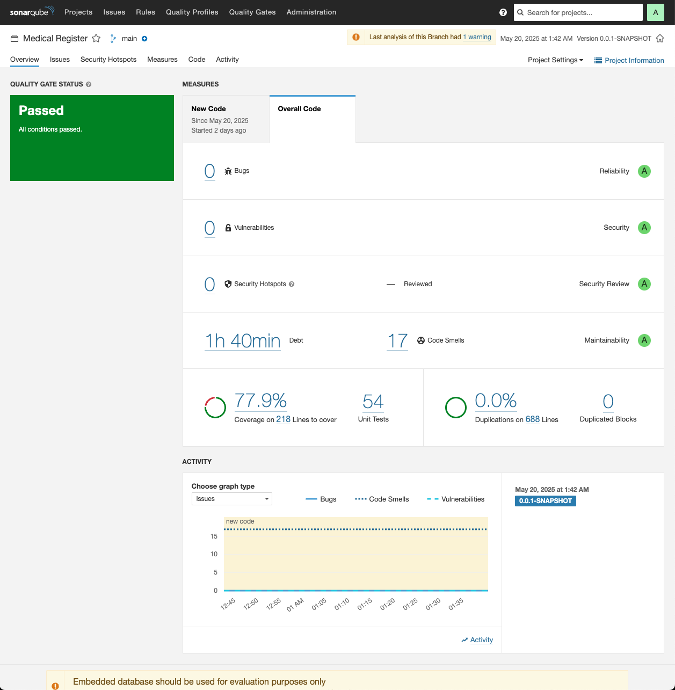

# Developer Guide: Medical Register Application

## 0. Prerequisites

The instructions in this guide are for developers with the following setup:

- **Operating System:** MacOS Applie Silicon
- **Editor:** VS Code

## 1. Create an Account with Auth0.com

Go to https://auth0.com/ and create an account.

At their `https://manage/auth0.com/` page, click on `Applications`, then `Create Application`.

In their Applciation URIs section, find `Allowed Callback URLs` and insert the following:

```bash
https://d3n8lb5zdun1i7.cloudfront.net/login/oauth2/code/auth0, http://localhost:8080/login/oauth2/code/auth0, http://localhost:80/login/oauth2/code/auth0
```

In their Applciation URIs section, find `Allowed Logout URLs` and insert the following:

```bash
http://d3n8lb5zdun1i7.cloudfront.net/?auth0logout=true, http://localhost:8080/?auth0logout=true, http://localhost/?auth0logout=true
```
Click `Save Changes`.

## 1. Start Up Project on Local Machine (without Kubernetes)

### 1.1. Local Setup

Open the Terminal app and install the following:

```bash
brew install openjdk@17
brew install maven
```

### 1.2. Create `src/main/resources/application-local.properties`

1. Create an `application-local.properties` file under `src/main/resources` and add the following:

    ```bash
    # Local Auth0 Configuration (DO NOT COMMIT THIS FILE)
    spring.security.oauth2.client.registration.auth0.client-id=<YOUR_CLIENT_ID>
    spring.security.oauth2.client.registration.auth0.client-secret=<YOUR_CLIENT_SECRET>
    spring.security.oauth2.client.registration.auth0.issuer-uri=https://<YOUR_DOMAIN>
    ```

2. For the time being, replace the placeholders with the following:
    - <YOUR_CLIENT_ID> with `HT5TFnmaRbens0MEMRfkvGqPUrSU9ZLB`
    - <YOUR_CLIENT_SECRET> with `SWoPOTRrvfeShx_jA64ebIGTqkGPYx75wDWyfqqhj8U2lffPsYxnDFoDsTRc3EpL`
    - <YOUR_DOMAIN> with `dev-z1arx3mmb04n4k4f.us.auth0.com`

### 1.3. Update `.vscode/launch.json`

In the `launch.json` file, add the following:

```json
{
  "configurations": [
    {
      "type": "java",
      "name": "MedicalRegisterApplication",
      "request": "launch",
      "mainClass": "com.example.medicalregister.MedicalRegisterApplication",
      "projectName": "medical-register",
      "vmArgs": "-Dspring.profiles.active=local"
    },
    {
      "type": "java",
      "name": "Spring Boot-MedicalRegisterApplication<medical-register>",
      "request": "launch",
      "cwd": "${workspaceFolder}",
      "mainClass": "com.arielyte.medical_register.MedicalRegisterApplication",
      "projectName": "medical-register",
      "args": "",
      "envFile": "${workspaceFolder}/.env"
    }
  ]
}
```

### 1.4. Run the Application

Open up `MedicalRegisterApplication.java` in VS Code.

Locate the "Play icon" at the top-right and click it to initiate the application.

Alternatively, you can use the Maven command:

1.  Open your terminal.
2.  Navigate to the root directory of the `medical-register` project (the directory containing `pom.xml`).
3.  Execute the following command:

    ```bash
    mvn clean package -DskipTests spring-boot:run
    ```

4. On your browser, navigate to `http://localhost:8080/`

## 2. Execute Regression Tests (excluding End-to-End Tests)

This section describes how to run the automated regression test suite. For this project, the primary command for regression testing executes unit and integration tests, while excluding end-to-end (e2e) tests. This provides a faster feedback loop on core functionality.

### 2.1. Executing the Tests

To run the regression tests (unit and integration tests, excluding e2e):

1.  Open your terminal.
2.  Navigate to the root directory of the `medical-register` project (the directory containing `pom.xml`).
3.  Execute the following command:

    ```bash
    mvn clean test -DexcludedTags=e2e
    ```

## 3. Execute End-to-End Tests

End-to-end (E2E) tests simulate real user scenarios by testing the application flow from the user interface (if applicable) down to the database and other backend services. These tests are critical for ensuring all parts of the application integrate and function together correctly.

1.  Open your terminal.
2.  Navigate to the root directory of the `medical-register` project (the directory containing `pom.xml`).
3.  Execute the following command:

    ```bash
    mvn clean package -DskipTests spring-boot:run -Dspring-boot.run.profiles=local
    ```

4. Navigate to `http://localhost:8080/test/login`
5. If you see `Simulated login successful for e2eTestUser`, it means the e2e test is up.

6. Go to `src/test/java/com/example/medicalregister/e2e/MedicalRecordE2ETest.java`, then execute the e2e test.


## 4. Run SonarQube

This section guides you on how to set up and run SonarQube locally using Docker and analyze your Maven project.

Example of [SonarQube Report](../img/SonarQube_2.png)


### 4.1. Prerequisites

- **Docker Desktop:** Ensure Docker Desktop is installed and running on MacOS. You can download it from the [Docker website](https://www.docker.com/products/docker-desktop/).
- **Project Code:** You should have the `medical-register` project code checked out.

### 4.2. Start SonarQube Container

1.  Open the Terminal app.
2.  Pull the SonarQube LTS Community Edition image and start a container. This command will also create Docker volumes to persist SonarQube data, so the analysis reports and configurations are saved even if you stop and restart the container.

    ```bash
    docker run -d --name sonarqube \
        -p 9000:9000 \
        -v sonarqube_data:/opt/sonarqube/data \
        -v sonarqube_logs:/opt/sonarqube/logs \
        -v sonarqube_extensions:/opt/sonarqube/extensions \
        sonarqube:lts-community
    ```
    - `-d`: Runs the container in detached mode.
    - `--name sonarqube`: Assigns a name to the container.
    - `-p 9000:9000`: Maps port 9000 on the host to port 9000 in the container (SonarQube's web UI).
    - `-v ...`: Mounts volumes for data persistence.

3.  SonarQube might take a few minutes to start up. You can check the logs using:
    ```bash
    docker logs -f sonarqube
    ```
    Wait until you see a line similar to `SonarQube is operational`.

### 4.3. Access SonarQube UI and Initial Setup

1.  Open a web browser and navigate to `http://localhost:9000`.
2.  Log in with the default administrator credentials:
    - **Username:** `admin`
    - **Password:** `admin`
3.  You will be prompted to change the default password. Do so for security.

### 4.4. Generate a SonarQube Analysis Token

To allow the Maven scanner to authenticate with the SonarQube server, you need to generate an analysis token.

1.  In the SonarQube UI, click on the avatar/initials in the top-right corner, then go to **My Account**.
2.  Select the **Security** tab.
3.  Under "Tokens", give the token a name (e.g., `medical-register-token`) and click **Generate**.
4.  **Important:** Copy the generated token immediately and store it in a safe place. You will not be able to see it again.

### 4.5. Run SonarQube Analysis with Maven

1.  Navigate to the root directory of `medical-register` project in the Terminal (the directory containing `pom.xml`).
2.  Run the following Maven command to perform the analysis. Replace `<YOUR_SONARQUBE_TOKEN>` with the token you generated in the previous step.

    ```bash
    mvn clean verify sonar:sonar \
      -Dsonar.projectKey=medical-register \
      -Dsonar.host.url=http://localhost:9000 \
      -Dsonar.login=<YOUR_SONARQUBE_TOKEN>
    ```
    - `mvn clean verify`: Cleans the project, compiles, and runs tests (JaCoCo will generate coverage reports which SonarQube can use).
    - `sonar:sonar`: Executes the SonarQube analysis.
    - `-Dsonar.projectKey=medical-register`: A unique identifier for the project in SonarQube. You can customize this.
    - `-Dsonar.host.url=http://localhost:9000`: Specifies the URL of the local SonarQube server.
    - `-Dsonar.login=<YOUR_SONARQUBE_TOKEN>`: The authentication token.

    *Note: If the `sonar-maven-plugin` were not already in the `pom.xml`, you would need to add it to the `<build><plugins>` section.*

### 4.6. View Analysis Results

1.  Once the Maven command completes successfully (it might take a few minutes), go back to the SonarQube UI in the browser (`http://localhost:9000`).
2.  You should see the "medical-register" project on the dashboard. Click on it to view the detailed analysis report, including code smells, bugs, vulnerabilities, and code coverage.

### 4.7. Stopping SonarQube

When you're done, you can stop the SonarQube container:
```bash
docker stop sonarqube
```
To start it again later (retaining data if you used volumes):
```bash
docker start sonarqube
```

## 5. Start Up Project on Local Machine (with Kubernetes) in Docker Desktop

This section outlines the steps to deploy and run the `medical-register` application on a local Kubernetes cluster provided by Docker Desktop. This allows you to test the application in a containerized environment that mimics aspects of a production setup, using `Dockerfile` and Kubernetes manifests from the `k8s` directory.

### 5.1. Prerequisites

-   **Docker Desktop:** Ensure Docker Desktop is installed and running on MacOS. You can download it from the Docker website.
-   **Kubernetes Enabled in Docker Desktop:**
    1.  Open Docker Desktop settings/preferences.
    2.  Navigate to the "Kubernetes" section.
    3.  Check the "Enable Kubernetes" box.
    4.  Click "Apply & Restart". Docker Desktop will download the necessary components and start a single-node Kubernetes cluster.
-   **`kubectl` CLI:** The Kubernetes command-line tool, `kubectl`, is typically included and configured automatically by Docker Desktop when you enable Kubernetes. Verify by opening the terminal and typing `kubectl version --client`.
-   **Project Code:** You should have the `medical-register` project code checked out.
-   **Maven:** Ensure Maven is installed (as per section "1.1. Local Setup") to build the project.

### 5.2. Build the Application JAR

First, you need to package the Spring Boot application into an executable JAR file. This JAR will be used by the `Dockerfile`.

1.  Open the terminal.
2.  Navigate to the root directory of the `medical-register` project (the directory containing `pom.xml`).
3.  Run the following Maven command:

    ```bash
    mvn clean package -DskipTests
    ```
    This command cleans previous builds, packages the application, and skips tests for a faster build. The resulting JAR file will be located in the `target/` directory (e.g., `target/medical-register-0.0.1-SNAPSHOT.jar`).
  

### 5.3. Review the Dockerfile

The `Dockerfile` defines how to build the Docker image for the application. It uses a multi-stage build to create an optimized runtime image and sets the `SPRING_PROFILES_ACTIVE` environment variable to `prod`. This means the application will look for an `application-prod.properties` file or expect production-related environment variables to be set.

### 5.4. Build the Docker Image

Now, build the Docker image using the `Dockerfile`. The image name and tag `medical-register-app:local` is used here to match what's specified in `deployment.yaml`.

1.  Ensure you are in the root directory of the `medical-register` project in the terminal.
2.  Run the following command:
    ```bash
    docker build -t medical-register-app:local .
    ```
    -   `-t medical-register-app:local`: Tags the image with the name `medical-register-app` and tag `local`.
    -   `.`: Specifies the build context (the current directory).

### 5.5 Create the `auth0-secret.yaml` file

Go to `/k8s` directory and create a `auth0-secret.yaml` file.

Input the following:

```bash
# Local Auth0 Configuration (DO NOT COMMIT THIS FILE)
apiVersion: v1
kind: Secret
metadata:
  name: auth0-credentials
type: Opaque
stringData: # Using stringData for readability; Kubernetes will base64 encode these.
  AUTH0_CLIENT_ID: "HT5TFnmaRbens0MEMRfkvGqPUrSU9ZLB"
  AUTH0_CLIENT_SECRET: "SWoPOTRrvfeShx_jA64ebIGTqkGPYx75wDWyfqqhj8U2lffPsYxnDFoDsTRc3EpL"
  AUTH0_ISSUER_URI: "https://dev-z1arx3mmb04n4k4f.us.auth0.com/"
```

### 5.6. Apply Kubernetes Manifests

Now, deploy your application and its configuration to the local Kubernetes cluster:

```bash
kubectl apply -f k8s/auth0-secret.yaml
kubectl apply -f k8s/deployment.yaml
kubectl apply -f k8s/service.yaml
```

### 5.7. Verify the Deployment

Check the status of your deployed resources:

1. **Check Deployment:**

```bash
kubectl get deployments -l app=medical-register
```

2. **Check Pods:**

```bash
kubectl get pods -l app=medical-register
```

3. **Check Service:**

```bash
kubectl get service medical-register-service
```

You should see an `EXTERNAL-IP` listed as `localhost`. The `PORT(S)` should show `80:NodePort_Number/TCP` (e.g., `80:30123/TCP`).

4. **Check Logs (if needed):**

If a pod is not starting correctly or you encounter issues, check its logs.

```bash
kubectl logs -l app=medical-register
```

### 5.8 Access the Application

Once the service is up and the pod is running and ready, you should be able to access the application.

Open a browser and navigate to: `http://localhost:80/`

The Auth0 `Allowed Callback URLs` and `Allowed Logout URLs` should already include `http://localhost:80/...` entries (e.g., `http://localhost:80/login/oauth2/code/auth0` and `http://localhost:80/?auth0logout=true`) from section "1. Create an Account with Auth0.com", which will work with this Kubernetes setup.

### 5.9. Cleaning Up
When you're finished, you can remove the application and its resources from the local Kubernetes cluster:

```bash
kubectl delete -f k8s/service.yaml
kubectl delete -f k8s/deployment.yaml
kubectl delete -f k8s/auth0-secret.yaml
```

To remove the Docker image you built (optional):

```bash
docker rmi medical-register-app:local
```

To disable Kubernetes in Docker Desktop if you no longer need it running, go back to Docker Desktop settings ("Kubernetes" section) and uncheck "Enable Kubernetes", then "Apply & Restart".

